### Escuela Colombiana de Ingeniería
### Arquitecturas de Software - ARSW
## Johan Guerrero
## Jhonatan Paez

## Escalamiento en Azure con Maquinas Virtuales, Sacale Sets y Service Plans

### Parte 1
# ---

1. Creamos la maquina virtual en azure
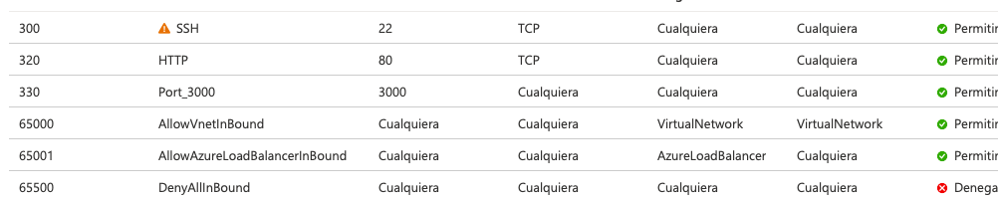

2. Hacemos la prueba inicial de la funcionalidad de la app

3. Iniciamos las pruebas de numeros mas elevados
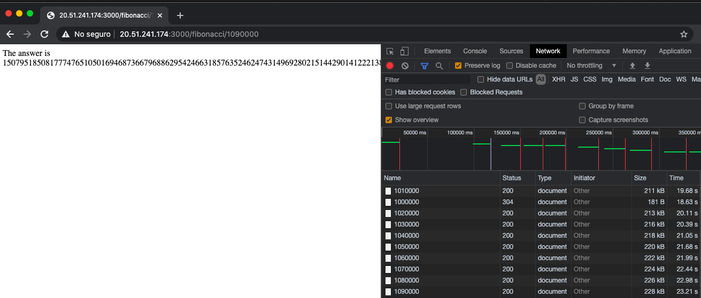

4. Aqui el grafico de el uso de la CPU
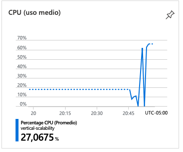

5. iniciamos la prueba con newman
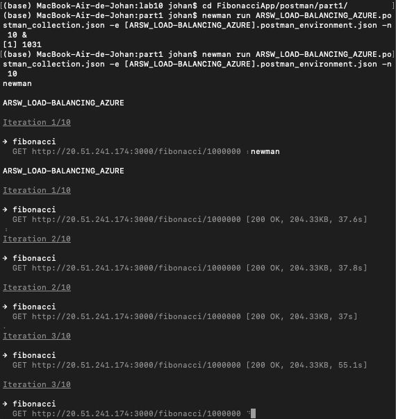

6. dandonos una respuesta de la siguiente manera
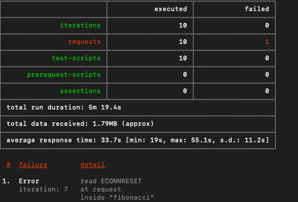

6. su correspondiente grafico, el cual muestra un uso elevado de CPU
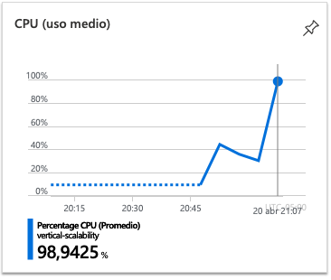

7. Aumentamos la cpu de la maquina
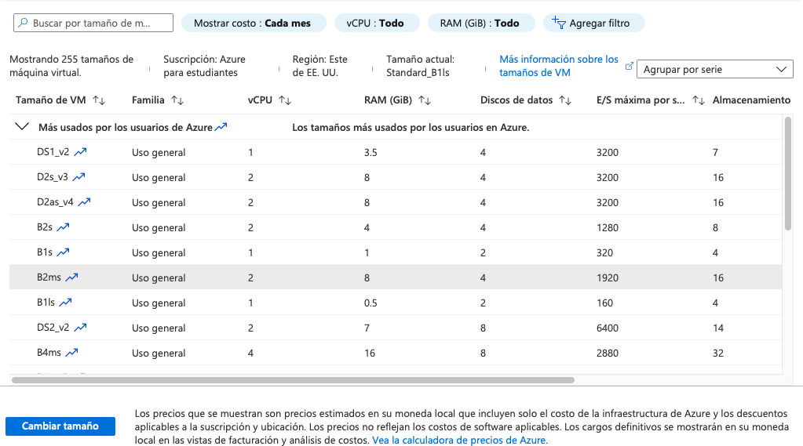

8. Iniciamos las pruebas con la nueva maquina
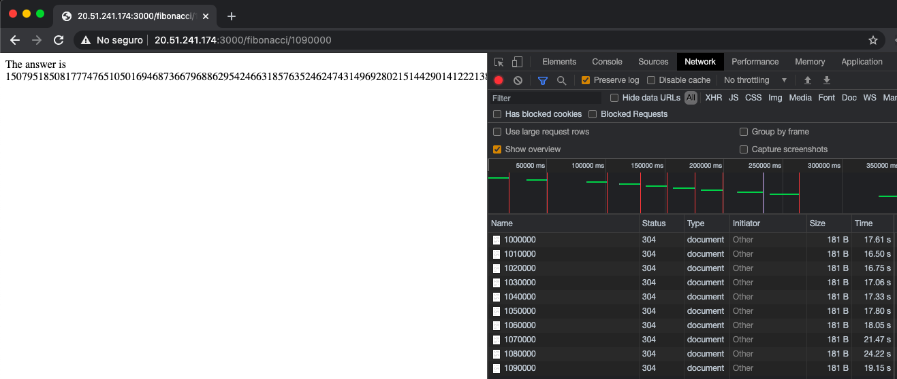

9. y su correspondiente grafico es:
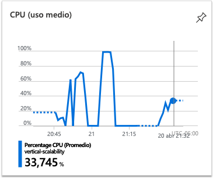

10. Prosegimos a realizar la prueba en newman:
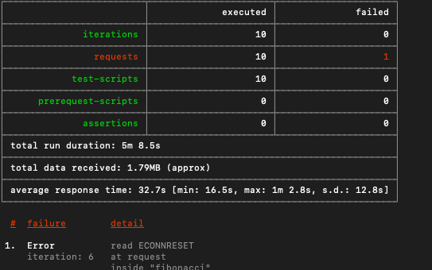

11. Y finalmente el grafico nuevo queda de la siguiente forma:
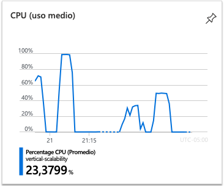

Usando este metodo de escalabilidad se aumento un poco el rendimiento de la aplicacion, sin embargo este es finito, va a llegar un momento donde no se pueda aumentar mas, y su costo beneficio es muy elevado.

## Preguntas:
# ¿Cuántos y cuáles recursos crea Azure junto con la VM?, ¿Brevemente describa para qué sirve cada recurso?
- Disco: representa el almacenamiento de la maquina virtual
- Clave SSH: es la clave publica que genera para la conexion
- Interfaz de red: es la interfaz que conecta la maquina con la red
- Grupos de seguridad de red: contienen las reglas de seguridad de red de Azure
- Direccion IP Publica: es la direccion IPV4 por la que se puede establecer conexion.
- Red Virtual: Proporciona un entorno aislado donde se puede usar ids privadas y definir subredes

# ¿Al cerrar la conexión ssh con la VM, por qué se cae la aplicación que ejecutamos con el comando npm FibonacciApp.js? ¿Por qué debemos crear un Inbound port rule antes de acceder al servicio?
---
- Si no ejecutamos el comando para que mantenga la ejecucion, se cae, sin embargo si ejecutamos el comando forever mantiene la conexion aun asi se haya salido del ssh. Sin embargo si se reinicia la maquina ese servicio que esta en ejecucion se cae por lo tanto toca volverlo a correr.
- Para permitir conexiones entrantes a ese puerto, el cual esta corriendo la aplicacion.
---

# Adjunte tabla de tiempos e interprete por qué la función tarda tando tiempo
---
La imagen de tablas se presenta en el numeral 3 y 8 anterior, y se puede ver que entre mas crece el numero mayor es el tiempo de respuesta del servidor, esto es debido a que la complejidad del algoritmo de fibonnaci que se tiene implementado con un ciclo tiende a ser lineal y por lo tanto cada numero crecera linealmente su tiempo respuesta. Si aumentamos los recursos el tiempo de mejora subira sin embargo la diferencia no es mucha.
---

# Adjunte imágen del consumo de CPU de la VM e interprete por qué la función consume esa cantidad de CPU.
---
La imagen del consumo se encuentra en el numeral 4 y numeral 9 , en el cual se muestra el consumo de CPU, en el primero debido a que solo hay una CPU todo el proceso lo lleva a cabo este y por lo tanto la utilizacion de este CPU sera alta, sin embargo al aumentarle los recursos de la maquina aparecio otra CPU y su capacidad de procesamiento aumento por lo tanto la disponibilidad de estas y la utilizacion baja.
---

# Adjunte la imagen del resumen de la ejecución de Postman. Interprete
---
- En la imagen 5 podemos ver las ejecuciones de peticiones, como estas se realizaron en paralelo en una sola CPU esta se tuvo que repartir el procesador entre los diferentes procesos en un determinado tiempo, lo que hace que una se demore mas que otra, en las dos pruebas paralelas que se lanzaron, y haciendo que el tiempo y el gasto de CPU sea mas elevado

- En la imagen 6 podemos ver los errores que se presentaron, y esto ha de ser debido al gran tiempo de espera que tuvo que esperar un proceso al paso del procesador.
---

# ¿Cuál es la diferencia entre los tamaños B2ms y B1ls (no solo busque especificaciones de infraestructura)?
---
Las principales diferencias son la memoria la primera tiene 8 y la segunda simplemente 0.5 gb, B2ms tiene un procesador mas que la otra, y el rendimiento base de la CPU en b2ms es mayor al otro
---

# ¿Aumentar el tamaño de la VM es una buena solución en este escenario?, ¿Qué pasa con la FibonacciApp cuando cambiamos el tamaño de la VM?

---
- No es la mejor solucion puesto que el performance no tuvo un cambio radical, sino que sus cambios son leves
- FibonacciApp tiene mejores tiempos de respuesta sin embargo no es muy elevado el cambio
---

# ¿Qué pasa con la infraestructura cuando cambia el tamaño de la VM? ¿Qué efectos negativos implica?
---
Esto genera que se tenga que reiniciar la maquina y ademas de reiniciar la maquina volver a iniciar el servicio que contiene el servidor de la App.
---

# ¿Hubo mejora en el consumo de CPU o en los tiempos de respuesta? Si/No ¿Por qué?
---
Si hubo mejora puesto que en el aumento de recursos se puso un nuevo procesador, el cual hace que el gasto de uno solo no sea elevado, ademas de que genera un mayor tiempo de respuesta.
---

# ---

